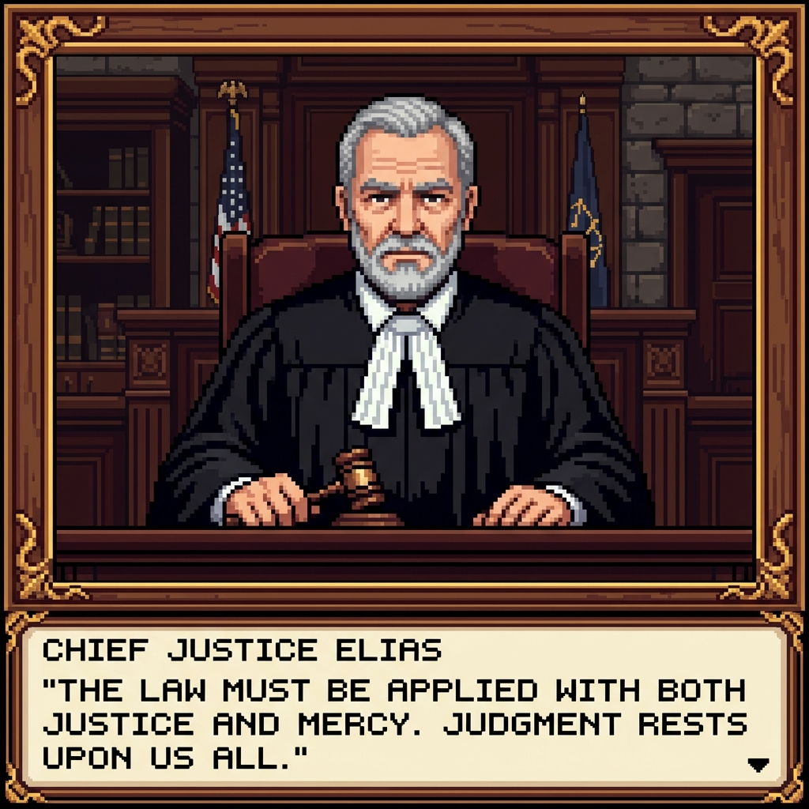

<div align="center">


# COURTROOM
### *Stop overthinking alone at 2 AM. Subpoena your personal history and put your life choices on trial.*

[](https://nextjs.org/)
[](https://fastapi.tiangolo.com/)
[](https://developer.nvidia.com/nim)
[](https://qdrant.tech/)
[](LICENSE)

<br />

> *"Your Obsidian graph has 1,200 nodes. Your Notion workspace has 47 color-coded databases. And yet, you still spent 45 minutes standing in your kitchen at midnight arguing with the microwave over whether to buy a $6 cold brew."*

</div>

---

<div align="center">
  
</div>

---

## 🏛️ The Problem: Your Second Brain is in a Coma

Be completely honest with yourself for thirty seconds.

You watched 19 YouTube productivity influencers talk about Tiago Forte's PARA method in front of a warm-toned bookshelf with an aesthetic plant. You downloaded Obsidian. You installed 34 community plugins, spent three days configuring Dataview queries, and built a knowledge graph that looks like a dying constellation.

You currently possess:
- A Notion page titled **"Core Life Principles & Sacred Boundaries (2022 Revised)"** that has accumulated more digital dust than an abandoned GeoCities site.
- An Apple Voice Memos directory with 300 audio files called **"New Recording 74"** where you ramble about career autonomy while breathing directly into your microphone on a windy walk.
- An Obsidian vault crammed with retrospective essays you swore you would re-read before making any major life pivot.

**And what actually happens when an actual life crossroads strikes?**
- *"Should I quit my stable job to build an unvalidated AI wrapper?"*
- *"Should I sign this lease in Manhattan or stay in my mom's basement and hoard runway?"*
- *"Should I buy an $800 espresso machine when I have $23 in my checking account and owe taxes?"*

Do you consult your Obsidian graph? **Of course you don't.**  
You stare at your ceiling. You scroll Reddit threads from 2018. You open ChatGPT and ask it for advice, to which it responds with the spine of a jellyfish:

> *"That is a deeply personal and nuanced question! Here are 7 arbitrary pros and 7 arbitrary cons. Remember to stay hydrated and follow your passion! 🌸✨"*

**ChatGPT doesn't know you.**  
It doesn't know you spent six months burned out in 2023 because you said yes to every client. It doesn't know that every time you work on a Sunday you turn into a miserable gremlin. It doesn't remember your painful regrets.

Your Second Brain isn't an engine. It's a digital graveyard of good intentions.

---

## ⚡ The Solution: The Adversarial Judicial Tribunal

**Courtroom** takes your dormant Second Brain—your Markdown dossier, vector memory bank, voice notes, and past committed decisions—and hooks it up to an **adversarial 16-bit retro courtroom tribunal**.

Instead of a static note you passively ignore, your actual history is **subpoenaed into court** by three autonomous AI agents who will happily roast your hypocrisy and hold you accountable to your own past words:

```
                      ┌────────────────────────────────────┐
                      │    YOUR REAL DILEMMA / CASE        │
                      │  "Should I accept this job offer?" │
                      └─────────────────┬──────────────────┘
                                        │
                       [ Subpoena Historical Records ]
                                        │
                                        ▼
                      ┌────────────────────────────────────┐
                      │        QDRANT VECTOR MEMORY        │
                      │  • Past Burnouts & Career Scars    │
                      │  • Stated Values in user.md        │
                      │  • Regrets of Hesitation           │
                      └─────────────────┬──────────────────┘
                                        │
                   ┌────────────────────┴────────────────────┐
                   ▼                                         ▼
        ┌──────────────────────┐                  ┌──────────────────────┐
        │     THE ADVOCATE     │                  │     THE SKEPTIC      │
        │ Counsel for Ambition │                  │  Counsel for Caution │
        │                      │◄─── CROSS-EX ───►│                      │
        │ "Exhibit A: In 2021  │                  │ "Objection! In 2023  │
        │ you wrote that play- │                  │ you burned out from  │
        │ ing it safe cost you │                  │ 70h sprints! This    │
        │ your best years!"    │                  │ gig has weekend on-  │
        │                      │                  │ call duty!"          │
        └──────────┬───────────┘                  └──────────┬───────────┘
                   │                                         │
                   └────────────────────┬────────────────────┘
                                        │
                                        ▼
                      ┌────────────────────────────────────┐
                      │         THE CHIEF JUSTICE          │
                      │     Supreme Arbiter of History     │
                      │                                    │
                      │ "The bench has heard enough.       │
                      │  *GAVEL SLAMS*: VERDICT BINDING."  │
                      └─────────────────┬──────────────────┘
                                        │
                      ┌─────────────────▼──────────────────┐
                      │         CLOSE THE FEEDBACK         │
                      │ Log actual decision → Re-embed     │
                      │ into Qdrant for all future trials. │
                      └────────────────────────────────────┘
```

---

## 👥 The Judicial Bench

| Character | Title | Portrait | Philosophy & Strategy |
| :--- | :--- | :---: | :--- |
| **The Advocate** | Counsel for Opportunity |  | **Pure offense.** Scours your memory archive for moments where hesitation destroyed momentum. Quotes your stated ambitions back at you and refuses to let you shrink into comfortable mediocrity. |
| **The Skeptic** | Counsel for Caution |  | **Pure defense.** The guardian of your financial runway, sleep hygiene, and mental stability. Cites your previous burnouts and impulse spending blow-ups as legal precedent to stop you from making stupid moves. |
| **The Chief Justice** | Supreme Arbiter of History |  | **Uncompromising impartiality.** Weighs both sides directly against your `user.md` constitutional baseline. Slams the golden gavel and hands down a binding, actionable verdict. |

---

## 🔥 What's New & Upgraded

### 1. 🧠 Dynamic Deliberation Engine (Zero Artificial Turn Limits)
- In the past, bad debate engines forced you through a rigid 6-turn marathon even if you just asked *"Should I get a cup of coffee"*.
- **Courtroom now adapts dynamically**:
  - Micro-dilemmas (*"Should I buy running shoes"*) resolve in **3–4 swift, razor-sharp turns**.
  - Existential quandaries (*"Should I drop out / leave my partner / sell my company"*) escalate into **up to 12 turns of intense adversarial cross-examination**.
  - Clutter-free UI: No tacky *"Turn 0 / 6"* progress bars breaking the theatrical illusion.

### 2. ⚡ NVIDIA NIM Ultra-Fast Constitution Synthesis
- Powered by NVIDIA NIM (`meta/llama-3.2-11b-vision-instruct` / Llama 3 family).
- **The Brain-Dump Translator**: Vent a chaotic, unformatted 3-sentence confession:
  > *"I refuse to work weekends, have 6 months savings runway, deeply regret turning down an AI startup last year, and value autonomy above all else."*
- Click **"Synthesize Dossier"** and NVIDIA NIM instantly extracts structured constitutional articles, formats them into `user.md`, and vectors them into Qdrant in parallel.

### 3. 📜 Living Dossier Subpoena Station (`user.md`)
- Direct visual inspection and editing of your identity file:
  - **Structured View**: Neat categories for Core Life Values, Non-Negotiable Boundaries, Stated Regrets, and Historical Baselines.
  - **Raw Markdown View**: Full text viewer with real-time byte counters and 1-click clipboard copy.
  - **Direct Disk Persistence**: Edits save straight to `backend/data/user.md`.

### 4. 💬 Pixel-Art Non-Intrusive Speech Chamber
- Re-architected dialogue system: speech bubbles **never cover or clip character sprites**.
- Dedicated high-contrast docket feed with retro pixel typography and sound-synthesized click cues.

---

## 🕹️ Visual Tour: 3D Chamber & 2D RPG Plan

| 3D Pixel Courtroom Chamber | 2D Judicial RPG Plan |
| :---: | :---: |
|  |  |
| *Real-time animated sprites, speaker spotlights, sconce lighting, and dynamic camera angles.* | *Top-down 16-bit RPG plan with interactive counsel tables, witness stand, and docket transcript.* |

---

## 🚀 Quick Start Guide

### Prerequisites
- **Node.js 18+** & `npm`
- **Python 3.10+**
- (Optional) NVIDIA NIM API Key or Lyzr Agent Studio credentials for hosted LLM acceleration.

### 1. Clone & Configure Backend

```bash
git clone https://github.com/subhwastaken/Courtroom.git
cd Courtroom/backend

# Create and activate virtual environment
python3 -m venv venv
source venv/bin/activate

# Install dependencies
pip install -r requirements.txt

# Configure your environment variables
cp .env.example .env
```

*(Edit `backend/.env` to configure your preferred embedding provider, Qdrant cluster, or NVIDIA NIM API key).*

### 2. Launch the Backend Server

```bash
python3 -m uvicorn main:app --host 0.0.0.0 --port 8000 --reload
```

Verify backend health:
```bash
curl http://localhost:8000/api/v1/health
# {"status":"healthy","system":"Courtroom Mode Backend","memories_synced":229}
```

### 3. Launch the Next.js Frontend

```bash
cd ../frontend
npm install
npm run dev
```

Open **`http://localhost:3000`** in your browser:
- **`/`** — The Neo-Brutalist Landing Page & Architecture Pipeline.
- **`/courtroom`** — The Live Judicial Chamber. Enter any dilemma and bang the gavel!
- **`/profile`** — The Living Identity Dossier (`user.md`) & Vector Memory Subpoena Tool.

---

## 🏗️ Architecture & Tech Stack

```
Courtroom/
├── backend/
│   ├── api/             # FastAPI routers (decision, memory, profile, voice)
│   ├── services/        # NVIDIA NIM synthesis, Qdrant vector engine, Embeddings
│   ├── data/            # Living profile (user.md) & local Qdrant memory storage
│   └── main.py          # FastAPI application entrypoint with CORS security
├── frontend/
│   ├── app/             # Next.js 14 App Router (landing, courtroom, profile)
│   ├── components/      # Neo-Brutalist CourtroomChamber, DialogueStream, Gavel
│   ├── public/          # 16-bit retro sprites, seals, badges, and brand logos
│   └── lib/             # Resilient API client & sound effects engine
├── seed/
│   └── seed_memories.py # Vector database memory seeder
└── README.md
```

- **Frontend**: Next.js 14 (App Router), React 18, Tailwind CSS, Lucide icons, Canvas scanlines, Web Audio API sound synthesis.
- **Backend**: FastAPI, Pydantic v2, Python 3.10+.
- **Synthesis & LLM**: NVIDIA NIM API (`meta/llama-3.2-11b-vision-instruct`), Lyzr Agent Cloud fallback.
- **Vector Database**: Qdrant Cloud / Local Vector Engine.
- **Embeddings**: `sentence-transformers` (`all-MiniLM-L6-v2`) with OpenAI embedding support.

---

## 📜 Legal Disclaimer & License

Courtroom verdicts are legally binding on your conscience only. We accept no responsibility if The Skeptic prevents you from buying a customized mechanical keyboard or if The Advocate convinces you to quit your job and live in a yurt.

Released under the **MIT License**. Crafted with precision by **Subharup Nandi**.
