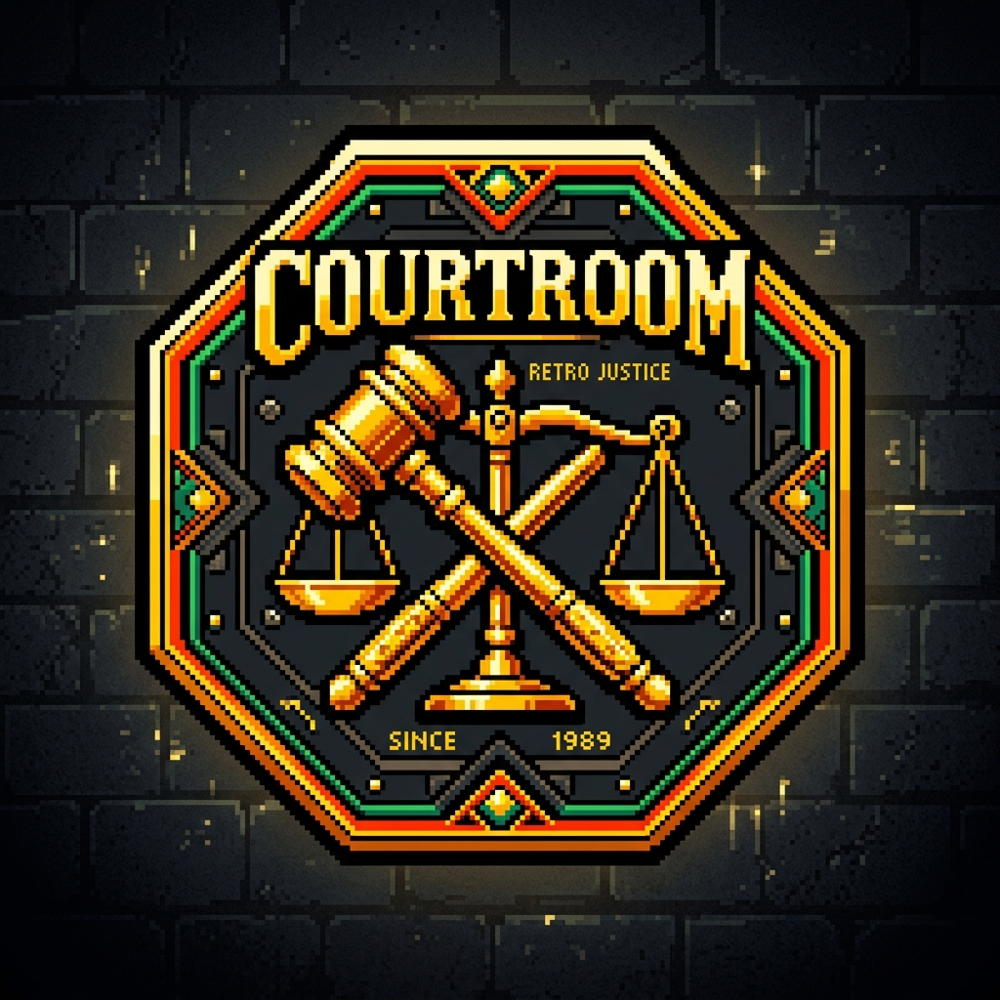
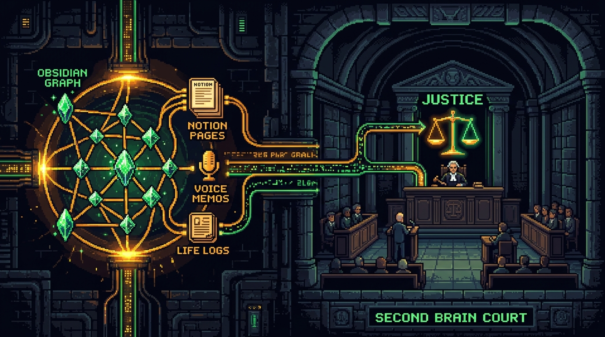
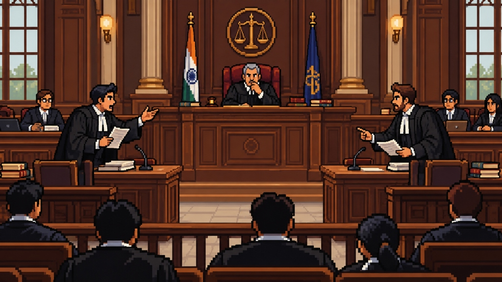
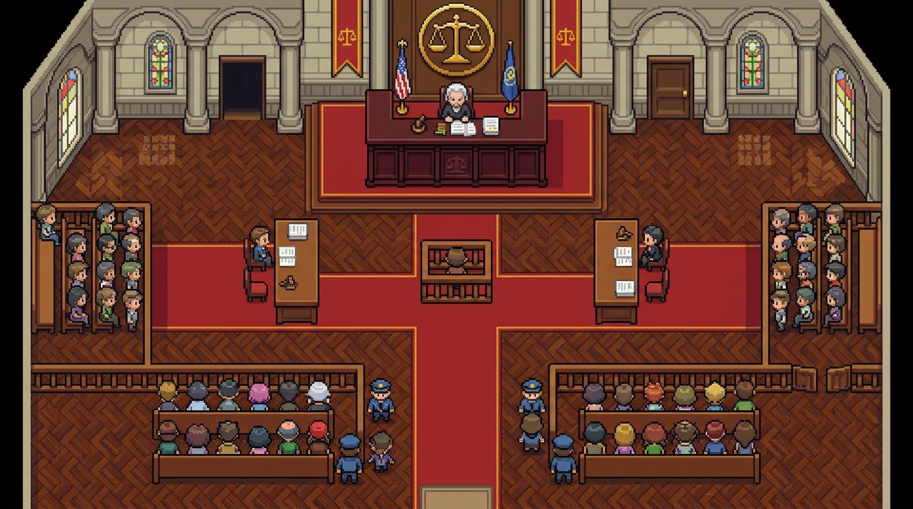

<div align="center">



# COURTROOM
### *Stop overthinking alone at 2 AM. Put your life decisions on trial before your own history.*

[](https://nextjs.org/)
[](https://fastapi.tiangolo.com/)
[](https://qdrant.tech/)
[](https://python.org/)
[](LICENSE)

<br />

> *"Your Obsidian graph has 900 nodes. Your Notion workspace has 40 databases. And yet, you still spent 45 minutes standing in your kitchen at midnight debating whether to reply to a Slack message."*

</div>

---

<div align="center">
  
</div>

---

## The Problem: The "Second Brain" Graveyard

Be honest with yourself for thirty seconds.

You watched 14 YouTube productivity gurus talk about Tiago Forte’s PARA method in front of a warm-toned bookshelf. You downloaded Obsidian. You installed 27 community plugins, configured Dataview, and spent an entire Sunday evening creating a graph view that looks like a dying galaxy.

You have:
- A Notion page titled *"Core Life Values & Non-Negotiables (2022)"* that hasn't been opened since the Obama administration.
- A voice memo folder with 400 audio files called *"New Recording 87"* where you talk about career goals while breathing heavily into your iPhone microphone.
- An Obsidian vault full of insightful retrospective notes you swore you would read before making major life choices.

**And what actually happens when a real crisis strikes?**
- *"Should I quit my corporate job to go full-time on an unvalidated AI wrapper?"*
- *"Should I part ways with my non-technical cofounder who hasn't pushed a commit since May?"*
- *"Should I buy an $800 espresso machine when I have $43 in my checking account?"*

Do you consult your Obsidian graph? **No.**
You consult the microwave clock. You scroll Reddit threads from 2017. You ask ChatGPT, which immediately acts like a cowardly sycophant:

> *"That is a deeply personal and nuanced question! Here are 7 pros and 7 cons. Remember to drink water and follow your heart! :)"*

**ChatGPT doesn't know you.** It doesn't know you spent six months depressed in 2021 because you hesitated on an offer. It doesn't know that every time you work on weekends you burn out and stop speaking to your friends.

Your second brain is dead. It's a digital cemetery of good intentions.

---

## The Solution: The Active Adversarial Courtroom

**Courtroom** takes your dormant Second Brain (your Markdown dossier, vector memory bank, voice notes, and past outcomes) and connects it to a **16-bit retro adversarial tribunal**.

Instead of a passive note you stare at, your actual history is **subpoenaed into court** by three autonomous AI agents with zero chill:

```
                      ┌────────────────────────────────────┐
                      │    YOUR REAL DILEMMA / CASE        │
                      │  "Should I accept the Seed Round?" │
                      └─────────────────┬──────────────────┘
                                        │
                       [ Subpoena Historical Records ]
                                        │
                                        ▼
                      ┌────────────────────────────────────┐
                      │        QDRANT VECTOR MEMORY        │
                      │  • Past Burnouts & Scars           │
                      │  • Stated Values in user.md        │
                      │  • Regrets of Hesitation           │
                      └─────────────────┬──────────────────┘
                                        │
                   ┌────────────────────┴────────────────────┐
                   ▼                                         ▼
        ┌──────────────────────┐                  ┌──────────────────────┐
        │     THE ADVOCATE     │                  │     THE SKEPTIC      │
        │ Counsel for Ambition │                  │  Counsel for Caution │
        │                      │◄─── CROSS-EX ───►│                      │
        │ "Exhibit A: In 2021  │                  │ "Objection! In 2023  │
        │ you wrote that play- │                  │ you burned out from  │
        │ ing it safe ruined   │                  │ investor pressure!   │
        │ your momentum!"      │                  │ Runway is 4 months!" │
        └──────────┬───────────┘                  └──────────┬───────────┘
                   │                                         │
                   └────────────────────┬────────────────────┘
                                        │
                                        ▼
                      ┌────────────────────────────────────┐
                      │         THE CHIEF JUSTICE          │
                      │     Supreme Arbiter of History     │
                      │                                    │
                      │ "The bench has deliberated.        │
                      │  GAVEL SLAMS: VERDICT BINDING."    │
                      └─────────────────┬──────────────────┘
                                        │
                      ┌─────────────────▼──────────────────┐
                      │         CLOSE THE FEEDBACK         │
                      │ Log actual decision → Re-embed     │
                      │ into Qdrant for all future trials. │
                      └────────────────────────────────────┘
```

### 1. The Advocate (Counsel for Opportunity)
- **Role**: Builds the offensive case FOR taking aggressive action, expanding, and leaping.
- **Weapon**: Scours your memory archive for moments where hesitation cost you momentum, quotes your core ambitions, and refuses to let you stay comfortable.
- *"Your Honor, the defendant wrote on October 4th that their biggest regret was waiting 2 years too long to build. Hesitation is the only real death!"*

### 2. The Skeptic (Counsel for Caution)
- **Role**: Protects your financial runway, mental stability, and boundaries.
- **Weapon**: Cites your painful past burnouts, financial traps, and impulse decisions that blew up in your face.
- *"OBJECTION! In Q3 2022, the defendant swore they would never accept a role with weekend on-call duty again after losing sleep and personal health. This offer violates their explicit boundary!"*

### 3. The Chief Justice (Supreme Arbiter of History)
- **Role**: Weighs both arguments against your explicit `user.md` constitutional dossier.
- **Weapon**: Strikes the golden gavel, issues a decisive ruling, and delivers binding judicial recommendations.

---

## The Dual-Engine Experience: 16-Bit Retro Chamber & 2D RPG Plan

We believe serious life decisions shouldn't feel like filling out an insurance claim. Courtroom is built with rich **16-bit retro neo-brutalist aesthetics**:

| 3D Pixel Courtroom Chamber | 2D Nintendo RPG Judicial Map |
| :---: | :---: |
|  |  |
| *Real-time animated sprites, speaker spotlights, wall sconce lighting, and dynamic camera zoom.* | *Top-down 16-bit RPG plan with interactive counsel tables, witness box, and retro dialogue engine.* |

---

## How Courtroom Actually Integrates into Your Daily Second Brain

Courtroom is not a gimmick. It is an **executable decision engine** that sits on top of your existing life data:

### 1. The Living Constitutional Dossier (`backend/data/user.md`)
Your core identity is kept in a plain, human-readable Markdown file. No proprietary lock-in. You define:
- Your non-negotiables (e.g. *"I will not work weekends for an employer"*).
- Your financial baselines (runway, debt, lifestyle floor).
- Your past major regrets and inflection points.

### 2. The Vector Memory Bank (Qdrant)
Every journal entry, past career decision, or voice recording is converted into dense semantic vectors (`sentence-transformers/all-MiniLM-L6-v2` or OpenAI). When you pose a question, the court performs **cosine similarity vector retrieval** to subpoena the 5 most relevant life memories to use as evidence.

### 3. Ambient & Voice Ingestion (Omi / Browser Mic)
Walking your dog or driving your car? Speak your dilemma into the built-in browser microphone or send an audio payload via webhook. The courtroom transcribes it and convenes the trial immediately.

### 4. Closing the Loop (Continuous Learning)
Once the Chief Justice hands down a ruling, you log what you actually decided. That choice is instantly appended to `user.md` and upserted back into Qdrant. **The courtroom remembers how your previous trials played out.**

---

## Quick Start

### Prerequisites
- Node.js 18+ & npm
- Python 3.10+

### 1. Launch the FastAPI Backend

```bash
cd backend

# Use the pre-configured virtual environment or create a new one
python3 -m venv venv
source venv/bin/activate
pip install -r requirements.txt

# Run the backend
uvicorn main:app --host 0.0.0.0 --port 8000 --reload
```

Verify backend health:
```bash
curl http://localhost:8000/api/v1/health
# {"status":"healthy","system":"Courtroom Mode Backend","memories_synced":8}
```

### 2. Seed Initial Memories (Starter Data)

Populate your local Qdrant collection with starter life memories, regrets, and career milestones:
```bash
cd seed
python3 seed_memories.py
```

### 3. Launch the Next.js Frontend

```bash
cd frontend
npm install
npm run dev
```

Visit **`http://localhost:3000`** in your browser:
- **`/`** — Neo-Brutalist Landing Page & Second Brain Pipeline Showcase.
- **`/courtroom`** — The 16-bit Judicial Chamber with live 3D & 2D views.
- **`/profile`** — Living Identity Dossier (`user.md`) & Vector Memory Search Explorer.

---

## Architecture & Tech Stack

```
Courtroom/
├── backend/
│   ├── api/             # FastAPI routers (decision, memory, profile, voice)
│   ├── services/        # Qdrant vector engine, Embeddings, Multi-Agent workflow
│   ├── data/            # Living profile (user.md) & local Qdrant storage
│   └── main.py          # FastAPI application entrypoint
├── frontend/
│   ├── app/             # Next.js 14 App Router (landing, courtroom, profile)
│   ├── components/      # Neo-Brutalist UI, CourtroomChamber, CourtroomPlan2D
│   ├── public/          # 16-bit retro sprites, maps, and official crest logo
│   └── lib/             # API client & sound effects engine
├── seed/
│   └── seed_memories.py # Starter dataset generator for vector DB
└── README.md
```

- **Frontend**: Next.js 14, React 18, Tailwind CSS, Lucide React (zero emojis), Canvas particle engine, Web Audio API sound synthesis.
- **Backend**: FastAPI, Pydantic, Python 3.10+.
- **Vector Database**: Qdrant (`user_memories` dense collection).
- **Multi-Agent Orchestration**: Lyzr Agent Studio / Local Grounded Fallback.
- **Embeddings**: `sentence-transformers` (`all-MiniLM-L6-v2`) with OpenAI embedding support.

---

## License

MIT License. Crafted with care by Subharup Nandi.
Stop overthinking alone. Let your memories speak before the bench.
